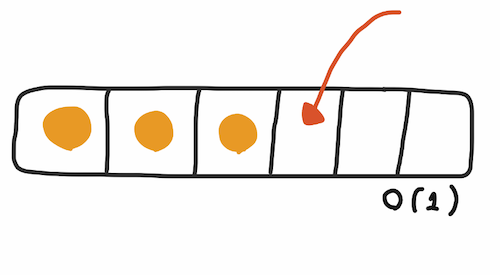
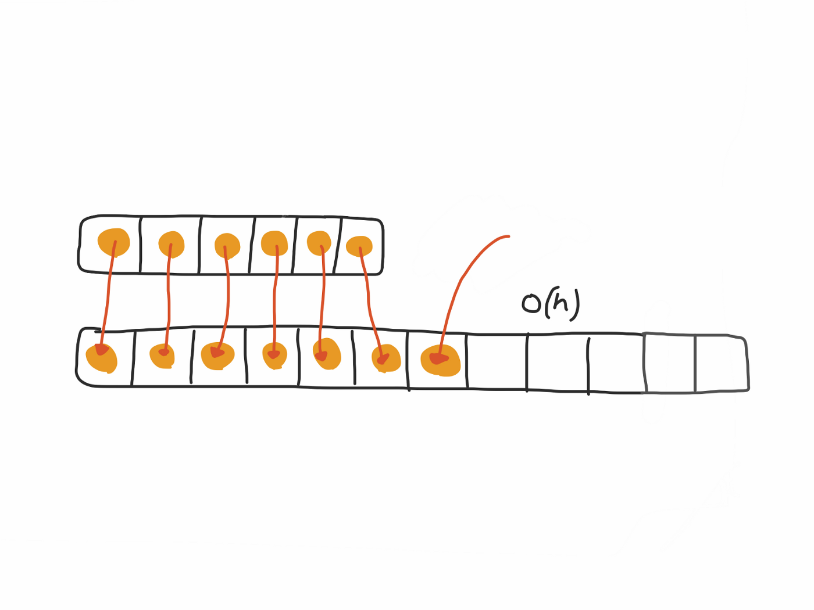

# Cracking the coding interview

## VI BIG O

### Amortized Time [ref.](https://medium.com/@satorusasozaki/amortized-time-in-the-time-complexity-of-an-algorithm-6dd9a5d38045)

When the array in it hasn’t reached its capacity and still has enough space to insert items.

When the array in it has reached its capacity and need to re-create itself with the doubled size.

